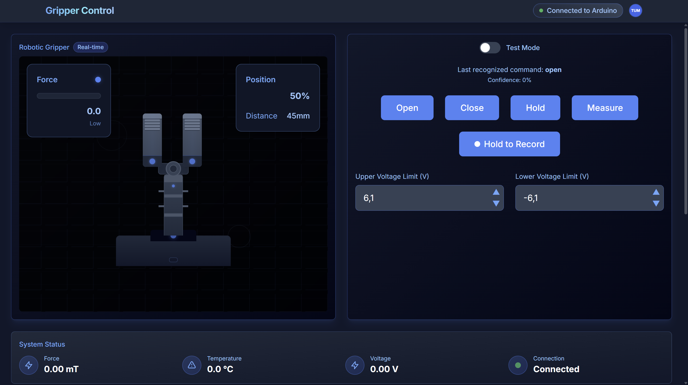

# Smart Gripper Project - Team 2r1p 🤖

## Project Overview
Our team has developed an advanced smart gripper system that combines precise control, real-time feedback, and intelligent object handling capabilities. The system features a modern web-based interface with voice control, real-time data visualization, and adaptive control strategies.

## Key Features

### 1. Intelligent Control System
- **Adaptive Force Control**: Dynamic adjustment of grip force based on object properties
- **Real-time Sensor Feedback**: Continuous monitoring using 3D magnetic sensors
- **Smart Object Detection**: Automatic detection of object properties (hardness, size, shape)
- **Voice Control Integration**: Natural language command interface

### 2. Advanced User Interface
- **Real-time Visualization**: Live monitoring of force, position, and sensor data
- **Interactive Controls**: Intuitive button and voice command interface
- **Data Analytics**: Comprehensive data logging and analysis tools
- **Responsive Design**: Modern, user-friendly web interface

### 3. Technical Innovations

#### Control System
- **Adaptive PID Control**: Self-tuning parameters based on object properties
- **Force Feedback Loop**: Real-time adjustment using magnetic sensor data
- **Smart Grip Strategy**: 
  - Automatic force adjustment for different materials
  - Gentle handling of fragile objects
  - Secure grip for heavy items
  - Adaptive response to object shape

#### Hardware Integration
- **Sensor Fusion**: Integration of multiple magnetic sensors for precise feedback
- **Motor Control**: Optimized BLDC motor control with voltage and current monitoring
- **Safety Features**: Automatic limit detection and emergency stop functionality

## Technical Implementation

### Hardware Stack
- **Main Controller**: Infineon XMC4700 Relax Kit
- **Sensors**: 
  - TLE5012 for position sensing
  - TLx493D for force and object detection
- **Actuators**: BLDC motor with integrated position feedback

### Software Architecture
- **Frontend**: React-based web interface
- **Backend**: Python server with WebSocket support
- **Firmware**: Custom Arduino implementation
- **Communication**: 
  - WebSocket for real-time data
  - Serial protocol for hardware control

### Control Algorithms
1. **PID Tuning System**
   - Automated parameter optimization
   - Real-time performance monitoring
   - Adaptive gain scheduling

2. **Smart Control Strategy**
   - Object property detection
   - Material classification
   - Force profile optimization

## Development Process

### Day 1: Hardware and Basic Control
- Initial hardware setup and calibration
- Motor parameter optimization
- Basic grip functionality implementation
- Hardware stability improvements

### Day 2: Software Integration
- Web interface development
- Real-time data visualization
- Voice control implementation
- Communication protocol design

## Future Improvements
1. **Enhanced Control**
   - Advanced PID auto-tuning
   - Machine learning-based parameter optimization
   - Temperature monitoring and compensation

2. **Object Detection**
   - Improved material classification
   - Shape recognition
   - Adaptive grip force profiles

3. **User Interface**
   - Advanced calibration tools
   - Diagnostic features
   - Performance analytics

## Technical Challenges and Solutions

### Challenge 1: Control Tuning
- **Problem**: Manual PID tuning for BLDC motors is complex and time-consuming
- **Solution**: 
  - Implemented automated tuning process
  - Developed adaptive control strategies
  - Created real-time performance monitoring

### Challenge 2: Smart Control
- **Problem**: Need for intelligent, adaptive control beyond basic PID
- **Solution**:
  - Implemented dynamic force adjustment
  - Developed object property detection
  - Created smart grip and release strategies

## Getting Started

### Prerequisites
- Python 3.8+
- Node.js 14+
- Arduino IDE
- Required hardware components

### Installation
1. Clone the repository
2. Install backend dependencies:
   ```bash
   pip install -r requirements.txt
   ```
3. Install frontend dependencies:
   ```bash
   cd frontend
   npm install
   ```
4. Upload firmware to Arduino
5. Start the backend server
   ```bash
   python server.py
   ```
7. Launch the frontend application
      ```bash
   npm run dev
   ```
## Frontend Showcase



## Contributing
We welcome contributions to improve the project. Please read our contributing guidelines for details.

## License
This project is licensed under the MIT License - see the LICENSE file for details.

## Acknowledgments
- Infineon crew for their guidance and support
